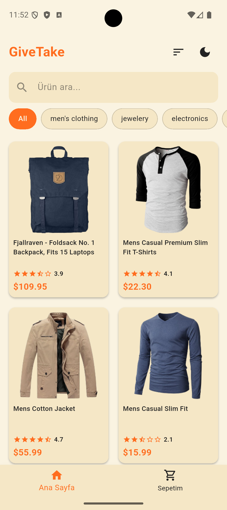
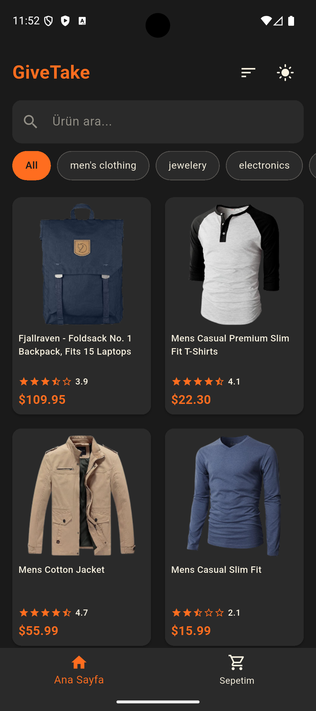
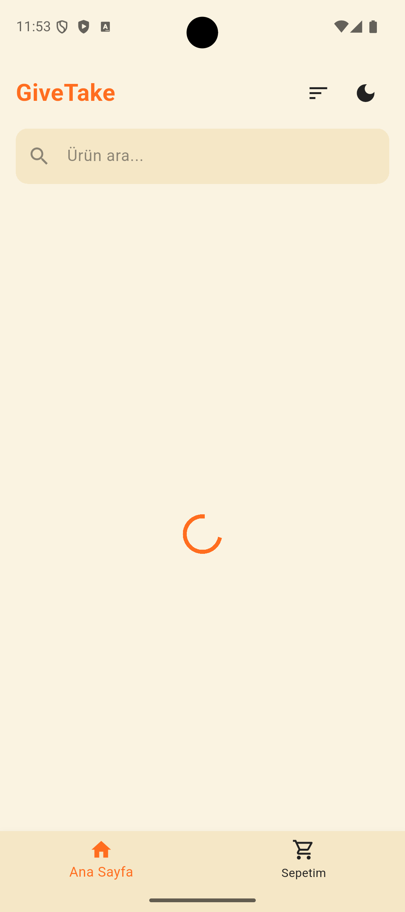
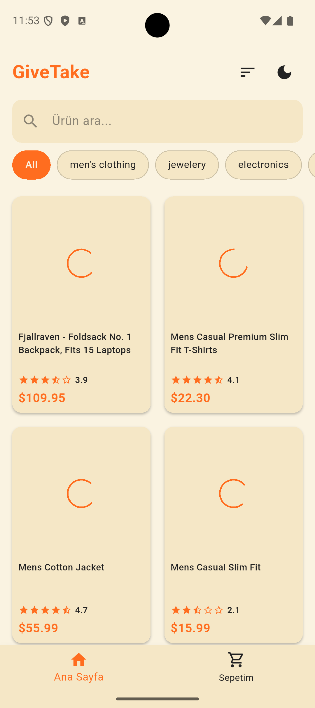
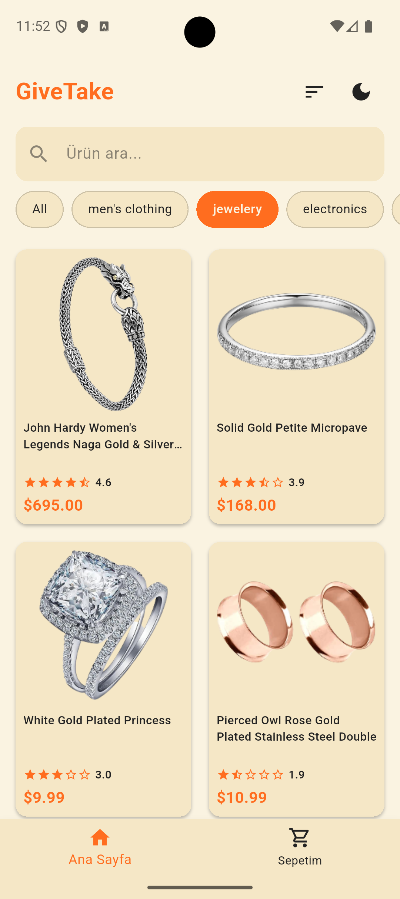
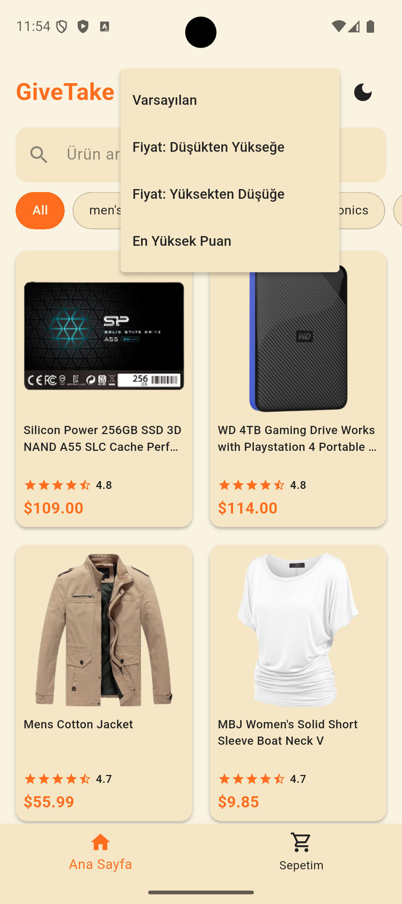
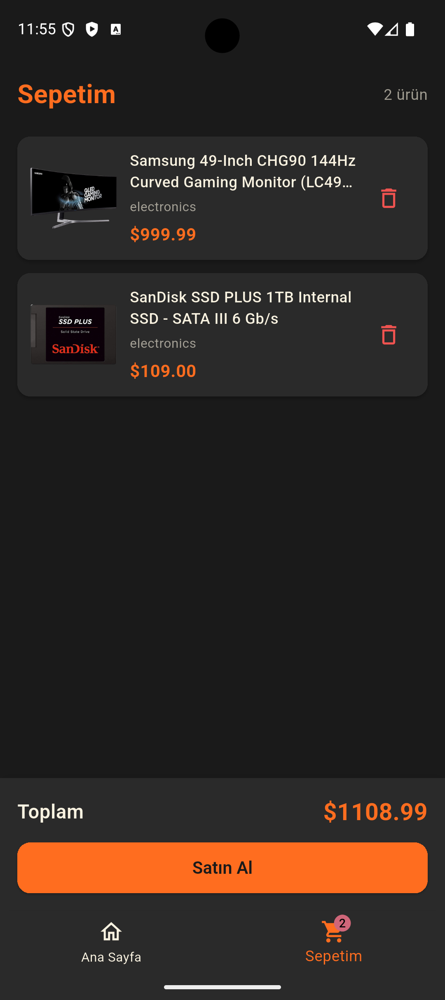
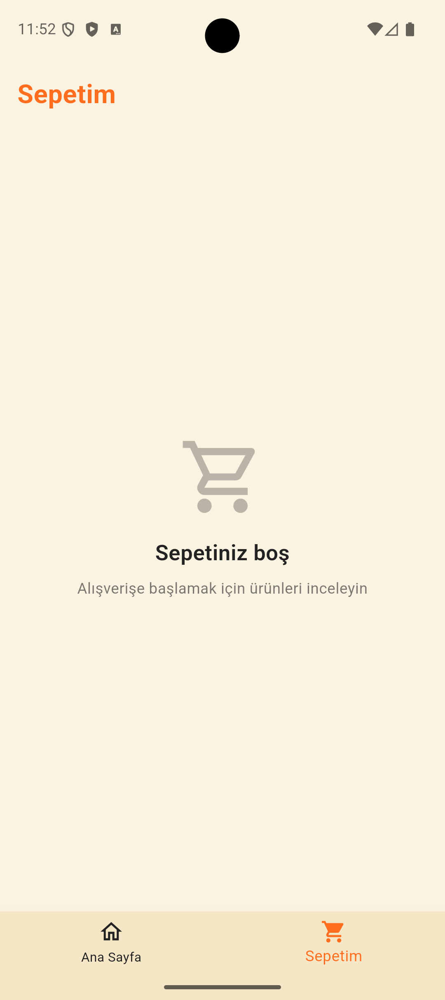

# 🛒 GiveTake

A modern mini-catalog shopping application built with **Flutter**, featuring product listing, search, filtering, sorting, shopping cart, and theme switching.

Data is fetched in real-time from the [Fake Store API](https://fakestoreapi.com/products).

## 📸 Screenshots

| Home | Dark Mode | Loading |
|:---:|:---:|:---:|
|  |  |  |

| Product Detail | Product Loading | Category Filter |
|:---:|:---:|:---:|
|  |  |  |

| Sort / Filter | Cart | Empty Cart |
|:---:|:---:|:---:|
|  |  |  |

## ✨ Features

### 🏠 Home Page
- **Product Grid** — Products are displayed in a responsive 2-column `GridView` layout
- **Loading Indicator** — A themed `CircularProgressIndicator` is shown while data is being fetched from the API
- **Image Loading** — Each product card displays an individual loading spinner while its image loads via `loadingBuilder`
- **Search Bar** — Real-time product search by title with a clearable text field
- **Category Filtering** — Horizontally scrollable category chips (`All`, `electronics`, `jewelery`, `men's clothing`, `women's clothing`)
- **Sorting** — Sort products via popup menu:
  - Default
  - Price: Low to High
  - Price: High to Low
  - Highest Rating
- **Error Handling** — Connection error screen with Wi-Fi off icon and a **"Tekrar Dene"** (Retry) button to reload products

### 📦 Product Detail Page
- **Hero Animation** — Smooth image transition between product card and detail page
- **Product Image** — Full-width product image (300px height) on white background
- **Category Badge** — Styled category label with primary color
- **Star Rating** — Visual star rating display with numeric score and review count
- **Price Display** — Large, bold price display in primary color
- **Description** — Full product description with proper line height
- **Add to Cart** — Bottom fixed button with `SnackBar` confirmation message

### 🛒 Cart Page
- **Cart Item List** — Horizontal card layout showing product image, title, category, and price
- **Remove Item** — Delete button to remove individual items from the cart
- **Item Count** — Shows number of items in header
- **Total Price** — Auto-calculated total price displayed at the bottom
- **Buy Button** — Simulated purchase button with `SnackBar` feedback
- **Empty Cart State** — Custom empty state widget with shopping cart icon and message
- **Cart Badge** — Bottom navigation bar shows item count badge on the cart icon

### 🎨 Theme System
- **Light/Dark Mode Toggle** — Switch between themes via icon button in the header
- **Custom Color Palette:**

| Element | Light Mode | Dark Mode |
|---------|-----------|-----------|
| Primary | `#FF6D1F` (Orange) | `#FF6D1F` (Orange) |
| Secondary | `#222222` (Dark Gray) | `#FAF3E1` (Light Beige) |
| Background | `#FAF3E1` (Light Beige) | `#1A1A1A` (Very Dark Gray) |
| Surface/Cards | `#F5E7C6` (Medium Beige) | `#2A2A2A` (Dark Gray) |

- **Themed Widgets:** AppBar, Card, BottomNavigationBar, ElevatedButton, TextField, Chip, Icon — all styled consistently

### 🧩 Reusable Components
| Component | Description |
|-----------|-------------|
| `ProductCard` | Grid card with image (cached at 200px), title, rating stars, and price |
| `CartItemCard` | Horizontal card for cart items with remove button |
| `CategoryChip` | Selectable chip for category filtering |
| `RatingDisplay` | Star rating with numeric score and optional review count |
| `EmptyState` | Configurable empty state with icon, title, and subtitle |
| `CustomAppBar` | Themed AppBar with optional back button and action buttons |

### ⚙️ Technical Details
- **API Service** — Fetches products from `https://fakestoreapi.com/products` using the `http` package
- **JSON Parsing** — `ProductService` model with `fromJson` / `toJson` methods, `Rating` sub-model with safe type casting (`num` → `double`)
- **Image Optimization** — `cacheWidth: 200` for memory-efficient image decoding, `gaplessPlayback: true` to prevent image flickering during scroll
- **State Management** — `setState` based state management with `StatefulWidget`
- **Navigation** — `IndexedStack` for bottom tab navigation, `MaterialPageRoute` for detail page
- **Error Image Handling** — `errorBuilder` displays placeholder icon when image fails to load

## 📁 Project Structure

```
lib/
├── main.dart                        # App entry point, theme & cart state
├── components/
│   ├── cart_item_card.dart           # Cart item horizontal card
│   ├── category_chip.dart           # Category filter chip
│   ├── custom_app_bar.dart          # Custom themed AppBar
│   ├── empty_state.dart             # Empty state display
│   ├── product_card.dart            # Product grid card
│   └── rating_display.dart          # Star rating widget
├── models/
│   └── product_service.dart         # ProductService & Rating models
├── services/
│   └── api_service.dart             # API calls, filtering, search, sort
├── utils/
│   ├── colors.dart                  # Light & dark mode color constants
│   └── theme.dart                   # ThemeData definitions
└── views/
    ├── home_view.dart               # Home page (grid, search, filter, sort)
    ├── product_detail_view.dart     # Product detail page
    └── cart_view.dart               # Shopping cart page
```

## 🚀 Getting Started

### Prerequisites
- Flutter SDK
- Android Studio / VS Code
- An Android or iOS device/emulator

### Installation

```bash
# Clone the repository
git clone https://github.com/Soo-de/givetake_app.git

# Navigate to the project
cd givetake_app

# Install dependencies
flutter pub get

# Run the app
flutter run
```

## 📦 Dependencies

| Package | Purpose |
|---------|---------|
| `flutter/material.dart` | UI framework |
| `http` | HTTP requests to Fake Store API |
| `dart:convert` | JSON encoding/decoding |
| `cupertino_icons` | iOS style icons |

## 🌐 API

This app uses the [Fake Store API](https://fakestoreapi.com/) to fetch product data.

- **Endpoint:** `GET https://fakestoreapi.com/products`
- **Response:** JSON array of 20 products with `id`, `title`, `price`, `description`, `category`, `image`, and `rating`

## 👤 Developer

**Sude** — [@Soo-de](https://github.com/Soo-de)
